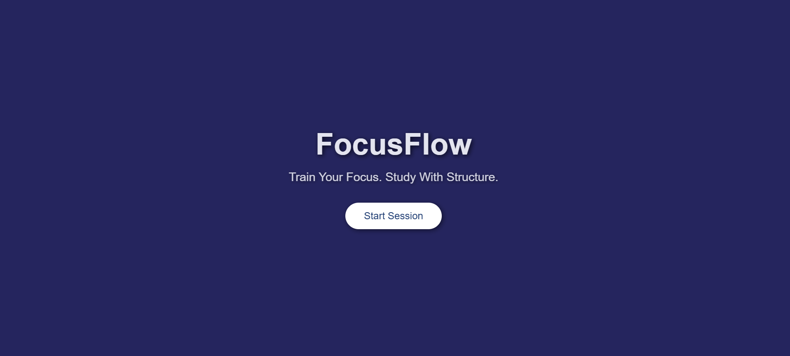
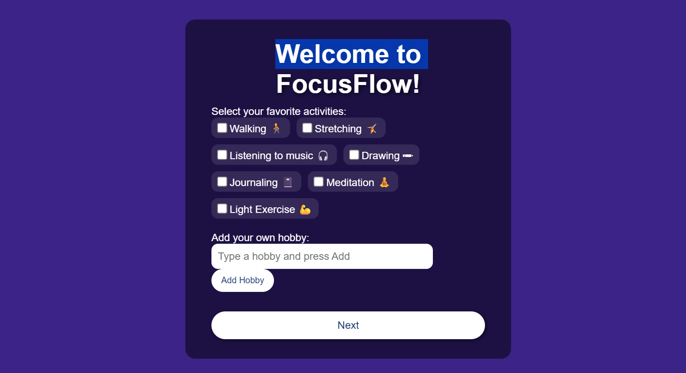
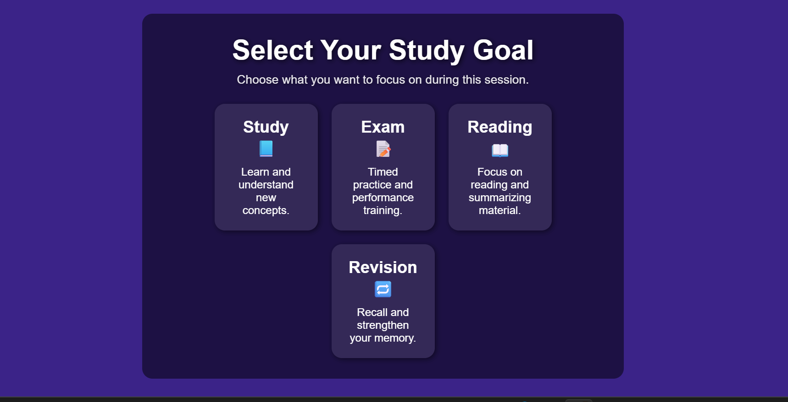

<p align="center">
  
</p>

# [FOCUSFLOW] 🎯

## Basic Details

### Team Name: [SheBit]

### Team Members
- Member 1: [Nafidha.U] - [EMEA college of arts and science]
- Member 2: [Jahana sherin] - [EMEA college of arts and science]

### Hosted Project Link
[ https://nafidhakareem.github.io/FocusFlow/ ]

### Project Description
[THis Project is study based website , that helps to students manage their time using structured study session and guided breaks.]

### The Problem statement
[Many students struggle to manage thier study time effectively and maintain focus for long periods. Continuous studying without proper breaks leads to tiredness , loss of concentration, and reduce productivity]

### The Solution
[We solved the problem by organising study time to focused sessions with guided breaks. It helps the students to stay concentrated in structured way.]

---

## Technical Details

### Technologies/Components Used

**For Software:**
- Languages used: [HTML, CSS, Javascript]
- Frameworks used: [NONE]
- Libraries used: [NONE]
- Tools used: [VS CODE, Git & GitHub]

**For Hardware:**
- Main components: [List main components]
- Specifications: [Technical specifications]
- Tools required: [List tools needed]

---

## Features

List the key features of your project:
- Feature 1: [Time based study sessions .]
- Feature 2: [Structured study and breaks flow]
- Feature 3: [Session completion Tracking]
- Feature 4: [Feedback page after completion]

---

## Implementation

### For Software:

#### Installation
```bash
[Installation commands - e.g., npm install, pip install -r requirements.txt]
```

#### Run
```bash
[Run commands - e.g., npm start, python app.py]
```

### For Hardware:

#### Components Required
[List all components needed with specifications]

#### Circuit Setup
[Explain how to set up the circuit]

---

## Project Documentation

### For Software:

#### Screenshots (Add at least 3)


this our welcome page and starting our website


this is hobby detecting page,it can understand user hobbies


user can choose different study goals like exams, study, reading,...


